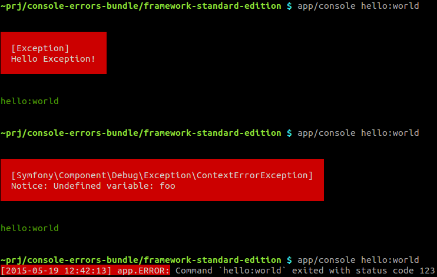

Console Errors Bundle
=======================

**Logging of exceptions and error codes for [Symfony Console](http://symfony.com/doc/current/components/console/introduction.html).**

Symfony by default logs uncaught exceptions in your controllers, but does not do this for Console commands. This bundle ensures all uncaught exceptions and errors are logged.

It also logs all command executions which ended with non-zero return code.

Here is an example showing an exception, error and non-zero return code:


And these are corresponding log entries:
```
[2015-05-19 12:41:19] app.ERROR: Exception: Hello Exception! (uncaught exception) at /home/vasek/dev/projects/console-errors-bundle/framework-standard-edition/src/AppBundle/Console/HelloCommand.php line 23 while running console command `hello:world` {"exception":"[object] (Exception(code: 0): Hello Exception! at /home/vasek/dev/projects/console-errors-bundle/framework-standard-edition/src/AppBundle/Console/HelloCommand.php:23)"} []
[2015-05-19 12:41:58] app.ERROR: Symfony\Component\Debug\Exception\ContextErrorException: Notice: Undefined variable: foo (uncaught exception) at /home/vasek/dev/projects/console-errors-bundle/framework-standard-edition/src/AppBundle/Console/HelloCommand.php line 23 while running console command `hello:world` {"exception":"[object] (Symfony\\Component\\Debug\\Exception\\ContextErrorException(code: 0): Notice: Undefined variable: foo at /home/vasek/dev/projects/console-errors-bundle/framework-standard-edition/src/AppBundle/Console/HelloCommand.php:23)"} []
[2015-05-19 12:42:13] app.ERROR: Command `hello:world` exited with status code 123 [] []
```

Installation
-----------

Install package [`vasek-purchart/console-errors-bundle`](https://packagist.org/packages/vasek-purchart/console-errors-bundle) with [Composer](https://getcomposer.org/):

```bash
composer require vasek-purchart/console-errors-bundle
```

Register the bundle in your application kernel:
```php
// app/AppKernel.php
public function registerBundles()
{
	return array(
		// ...
		new VasekPurchart\ConsoleErrorsBundle\ConsoleErrorsBundle(),
	);
}
```

